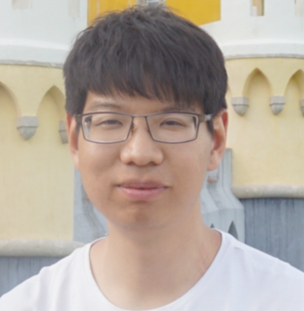

<nav class="navbar navbar-dark navbar-expand-lg fixed-top">
    

        <a href="http://www.mu4yang.com">Home</a>
        <a href="#pub">Publications</a>
        <a href="#pub">Projects</a>
    

</nav>

# Linlin Yang
<html>
<head>
<title>Font Awesome Icons</title>
<meta name="viewport" content="width=device-width, initial-scale=1">
<link rel="stylesheet" href="https://cdnjs.cloudflare.com/ajax/libs/font-awesome/4.7.0/css/font-awesome.min.css">
</head>
<body>
<a href="mailto:mu4yang@gmail.com"><i class="fa fa-fw fa-envelope" aria-hidden="true"></i> Email</a> &nbsp; 
<a href="https://scholar.google.com.hk/citations?user=gI55gF0AAAAJ&hl=en-US"><i class="fa fa-fw fa-graduation-cap"></i> Google Scholar</a>
</body>
</html> 

 

I have joined Communication University of China (CUC). Earlier I completed my PhD at University of Bonn. 

##  Research Interests
Hand/Human Pose Estimation, Semi-/Self-Supervised Learning and Network Quantization.

## Professional Services 

Workshop Organizer: DexHAND(<a href="http://hands-workshop.org">@ECCV26</a>), the HANDS workshop series (<a href="http://hands-workshop.org">@ICCV25</a>, <a href="http://hands-workshop.org">@ECCV24</a>, <a href="https://sites.google.com/view/hands2023/">@ICCV23</a>, <a href="https://sites.google.com/view/hands2022/home">@ECCV22</a>)  
Area Chair: NeurIPS(24-25), ICML(25-26)  
Reviewer: Top-tier conferences and journals like CVPR, ICCV, ECCV, ICLR 

## Recent News

<ul>
<li> Jun 2026: One paper is accepted to PR2026.</li>
<li> Jun 2026: Two papers are accepted to ECCV2026.</li>
<li> May 2026: One paper is accepted to PR2026.</li>
<li> May 2026: One paper is accepted to TCSVT2026.</li>
<li> May 2026: Three papers are accepted to ICML2026.</li>
<li> Apr 2026: We will host DexHAND workshop in conjunction with ECCV26! See you in Malmö, Sweden.</li>
<li> Mar 2026: One paper is accepted to ICME26.</li>
<li> Mar 2026: One paper is accepted to IJCNN26.</li>
<li> Mar 2026: One paper is accepted to CVPR26 and one paper is accepted to CVPR26 Findings.</li>
<li> Jan 2026: We will host Efficient Methods for Multimodal Models (EMM) workshop in conjunction with ICPR26!.</li>
<li> Jan 2026: Four papers are accepted to ICLR2026.</li>
<li> Jan 2026: One paper is accepted to ICASSP2026.</li>
<li> Jan 2026: One paper is accepted to Neurocomputing2026.</li>
<li> Jan 2026: One paper is accepted to PR2026.</li>
<li> Dec 2025: One paper is accepted to TCSVT2025.</li>
<li> Nov 2025: I will serve as an area chair of ICML2026.</li>
<li> Nov 2025: Two papers are accepted to AAAI2026.</li>
<li> Sep 2025: One paper is accepted to TMM2025.</li>
<li> Jun 2025: Two papers are accepted to ICCV2025.</li>
<li> May 2025: One paper is accepted to ICML2025.</li>
<li> Apr 2025: We will host 9th HANDS workshop in conjunction with ICCV25! See you in Honolulu.</li>
<li> Feb 2025: Two papers are accepted to CVPR2025.</li>
<li> Feb 2025: I will serve as an area chair of NeurIPS2025.</li>
<li> Jan 2025: Two papers are accepted to ICLR2025.</li>
<li> Dec 2024: One paper is accepted to ICASSP2025.</li>
<li> Dec 2024: I will serve as an area chair of ICML2025.</li>
<li> Dec 2024: One paper is accepted to TIP2024.</li>
<li> Sep 2024: One paper is accepted to NeurIPS2024.</li>
<li> May 2024: One paper is accepted to Neurocomputing2024.</li>
<li> Apr 2024: We will host 8th HANDS workshop in conjunction with ECCV24! See you in Milano.</li>
<li> Mar 2024: I will serve as an area chair of <a href="https://neurips.cc/Conferences/2024/ProgramCommittee#all-area-chairs">NeurIPS2024</a>. </li>
<li> Dec 2023: One paper is accepted to AAAI2024. </li>
<li> Dec 2023: I am on <a href="https://neurips.cc/Conferences/2023/ProgramCommittee">the list of Top Reviewers of NeurIPS2023</a>. </li>
<li> Oct 2023: One paper is accepted to WACV2024. </li>
<li> Sep 2023: One paper is accepted to NeurIPS2023. </li>
<li> Jul 2023: One paper is accepted to ICCV2023. </li>
<li> Jul 2023: One paper is accepted to GCPR2023. </li>
<li> May 2023: One paper is accepted to IJCV2023. </li>
<li> Mar 2023: We will host 7th HANDS workshop in conjunction with ICCV23! </li>
<li> Mar 2023: One paper is accepted to TPAMI2023. </li>
<li> Feb 2023: Three papers are accepted to CVPR2023. </li>
<li> Jan 2023: One paper is accepted to ICLR2023. </li>
<li> Nov 2022: I have successfully completed my PhD defense. </li>
</ul>

## Publications [[Preprint](#Preprint) - [2026](#pub2026) - [2025](#pub2025) - [2024](#pub2024) - [2023](#pub2023) - [2022 and before](#pub2022)]

<h3 id="Preprint">Preprint</h3>

- CL-CLIP: CLIP-Based Continual Learning Framework with Cost-Volume Category Decoupling for Object Detection 
Zihan Liu, Yuguang Yang, Shengjie Su, Jianing Pang, **Linlin Yang**, Chunyu Xie, Nikolai Yu. Zolotykh, Baochang Zhang 
*arXiv*, 2026. 
[[arXiv]](https://arxiv.org/abs/2606.06978)

- Circuit-Inspired High-Order Neural Networks with Unified Neural Dynamics Modeling for PDE Solving and Visual Perception 
Tongfei Chen, Jingying Yang, **Linlin Yang**, Juan Zhang, Jinhu Lü, David Doermann, Chunyu Xie, Long He, Tian Wang, Guodong Guo, Baochang Zhang 
*arXiv*, 2026. 
[[arXiv]](https://arxiv.org/abs/2603.23977)

- ESOM: Efficiently Understanding Streaming Video Anomalies with Open-world Dynamic Definitions 
Zihao Liu, Xiaoyu Wu, Wenna Li, Jianqin Wu, **Linlin Yang** 
*arXiv*, 2026. 
[[arXiv]](https://arxiv.org/pdf/2604.07772)

- Rethinking Metrics and Benchmarks of Video Anomaly Detection 
Zihao Liu, Xiaoyu Wu, Wenna Li, **Linlin Yang** 
*arXiv*, 2025. 
[[arXiv]](https://arxiv.org/pdf/2505.19022)

- Squeeze10-LLM: Squeezing LLMs' Weights by 10 Times via a Staged Mixed-Precision Quantization Method 
Qingcheng Zhu, Yangyang Ren, **Linlin Yang**, Mingbao Lin, Yanjing Li, Sheng Xu, Zichao Feng, Haodong Zhu, Yuguang Yang, Juan Zhang, Runqi Wang, Baochang Zhang 
*arXiv*, 2025. 
[[arXiv]](https://www.arxiv.org/pdf/2507.18073)

<h3 id="pub2026">2026</h3>

- Security-Aware Post-Training Quantization for Mixture-of-Experts Large Language Models 
Boyu Liu, Shiran Ge, Zhiyi Zhu, Canjia Li, **Linlin Yang**, Baochang Zhang 
*PR*, 2026. 

- InfraNet: Quality-Aware RGB Guidance for Infrared Object Detection 
Zichao Feng, Haodong Zhu, Jingying Yang, **Linlin Yang**, Yangyang Ren, Sheng Xu, Yuguang Yang, Xuhui Liu, Juan Zhang, Tian Wang, Baochang Zhang 
*ECCV*, 2026. 

- Teaching Vision-Language-Action Models What to See and Where to Look 
Yuguang Yang, Canyu Chen, Zhewen Tan, Yizhi Wang, Zichao Feng, Chunyang Liu, Kehua Sheng, Bo Zhang, Yan Wang, Juan Zhang, **Linlin Yang**, Baochang Zhang, Xianbin Cao 
*ECCV*, 2026. 

- SURGE: Surrogate Gradient Adaptation in Binary Neural Networks 
Haoyu Huang\#, Boyu Liu\#, **Linlin Yang**\*, Yanjing Li, Yuguang Yang, Xuhui Liu, Canyu Chen, Zhongqian Fu, Baochang Zhang 
*ICML*, 2026. 
[[arXiv]](https://arxiv.org/abs/2605.10989)

- FAIR-Calib: Frontier-Aware Instability-Reweighted Calibration for Post-Training Quantization of Diffusion Large Language Models 
Haoyu Huang, **Linlin Yang**\*, Sheng Xu, Boyu Liu, Guodong Guo, Zhongqian Fu, Hang Zhou, Baochang Zhang 
*ICML*, 2026. 
[[arXiv]](https://arxiv.org/abs/2606.06547)

- Unbiased Dynamic Pruning for Efficient Group-Based Policy Optimization 
Haodong Zhu\#, Yangyang Ren\#, Yanjing Li\*, Mingbao Lin, **Linlin Yang**\*, Xuhui Liu, Xiantong Zhen, Haiguang Liu, Baochang Zhang 
*ICML*, 2026. 
[[arXiv]](https://arxiv.org/pdf/2603.04135)

- LDFE: Laplacian Decoupled Feature Enhancement Block for Dual-Stream CNN-based RGB-IR Object Detection 
Wenhao Donga, Xiaoyan Luo, **Linlin Yang**\*, Haodong Zhu, Xiaorong Shi, Guodong Guo, Baochang Zhang 
*PR*, 2026. 

- BinParam: Binarized human parametric modeling via distribution alignment and orthogonal residuals 
Yingjie Chen, **Linlin Yang**\*, Ziqi Xie, Boshu Jia, Boyu Liu, Baochang Zhang, Xiaoyu Wu, Libiao Jin 
*Neurocomputing*, 2026. 

- Online Test-time Adaptation for 3D Human Pose Estimation: A Practical Perspective with Estimated 2D Poses 
Qiuxia Lin, Kerui Gu, **Linlin Yang**, Angela Yao 
*TCSVT*, 2026. 
[[arXiv]](https://arxiv.org/pdf/2503.11194)

- MedFact-R1: Towards Factual Medical Reasoning via Pseudo-Label Augmentation 
Gengliang Li\#, Rongyu Chen\#, Bin Li, **Linlin Yang**\*, Guodong Ding, Angela Yao 
*ICASSP*, 2026. 
[[arXiv]](https://arxiv.org/pdf/2509.15154)

- UniGuard: A Unified In-Process Watermarking Framework for Text-to-3D Generation 
Shali Wang\#, Boshu Jia\#, Yong Hu\*, **Linlin Yang**\*, Jin Yang, and Shunyang Zeng 
*ICME*, 2026. 

- MLVTG: Mamba-Based Feature Alignment and LLM-Driven Purification for Multi-Modal Video Temporal Grounding 
Zhiyi Zhu, Xiaoyu Wu, Zihao Liu, **Linlin Yang** 
*IJCNN*, 2026. 
[[arXiv]](https://arxiv.org/abs/2506.08512)

- Devil is in Narrow Policy: Unleashing Exploration in Driving VLA Models 
Canyu Chen\#, Yuguang Yang\#, Zhewen Tan, Yizhi Wang, Ruiyi Zhan, Haiyan Liu, Xuanyao Mao, Jason Bao, Xinyue Tang, **Linlin Yang**\*, Bingchuan Sun\*, Yan Wang\*, Baochang Zhang 
*CVPR findings*, 2026. 
[[arXiv]](https://arxiv.org/abs/2603.06049)

- PartDiffuser: Part-wise 3D Mesh Generation via Discrete Diffusion 
Yichen Yang\#, Hong Li\#, Haodong Zhu, **Linlin Yang**\*, Guojun Lei, Sheng Xu, Baochang Zhang 
*CVPR*, 2026. 
[[arXiv]](https://arxiv.org/pdf/2511.18801)

- UrbanGS: Efficient and Scalable Architecture for Geometrically Accurate Large-Scene Reconstruction 
Changbai Li\#, Haodong Zhu\#, Hanlin Chen, Xiuping Liang, Tongfei Chen, Shuwei Shao, **Linlin Yang**\*, Huobin Tan\*, Baochang Zhang 
*ICLR*, 2026. 
[[arXiv]](https://arxiv.org/abs/2602.02089)

- Language-guided Open-world Video Anomaly Detection under Weak Supervision 
Zihao Liu, Xiaoyu Wu, Jianqin Wu, Xuxu Wang,  **Linlin Yang** 
*ICLR*, 2026. 
[[arXiv]](https://arxiv.org/abs/2503.13160)

- SesaHand: Enhancing 3D Hand Reconstruction via Controllable Generation with Semantic and Structural Alignment 
Zhuoran Zhao, Xianghao Kong,  **Linlin Yang**, Zheng Wei, Pan Hui, Anyi Rao 
*ICLR*, 2026. 
[[arXiv]](https://arxiv.org/abs/2603.00443)

- AMLRIS: Alignment-aware Masked Learning for Referring Image Segmentation 
Tongfei Chen\#, Shuo Yang\#, Yuguang Yang\#,  **Linlin Yang**\*, Runtang Guo, Changbai Li, He Long, Chunyu Xie\*, Dawei Leng, Baochang Zhang 
*ICLR*, 2026. 
[[arXiv]](https://arxiv.org/abs/2602.22740)

- Noise-Robust Tiny Object Localization with Flows 
Huixin Sun, **Linlin Yang**, Ronyu Chen, Kerui Gu, Baochang Zhang, Angela Yao, Xianbin Cao 
*PR*, 2026. 
[[arXiv]](https://arxiv.org/pdf/2601.00617)

- EFlat-LoRA: Efficiently Seeking Flat Minima for Better Generalization in Fine-Tuning Large Language Models and Beyond 
Jiaxin Deng\#, Qingcheng Zhu\#, Junbiao Pang, **Linlin Yang**, Zhongqian Fu, Baochang Zhang 
*AAAI*, 2026. 
[[arXiv]](https://arxiv.org/pdf/2508.00522)

- AnchorDS: Anchoring Dynamic Sources for Semantically Consistent Text-to-3D Generation 
Jiayin Zhu, **Linlin Yang**, Yicong Li, Angela Yao 
*AAAI*, 2026. 

<h3 id="pub2025">2025</h3>

- InstructHumans: Editing Animated 3D Human Textures with Instructions 
Jiayin Zhu, **Linlin Yang**, Angela Yao 
*IEEE Transactions on Multimedia (TMM)*, 2025. 
[[arXiv]](https://arxiv.org/abs/2404.04037) 

- M3DP: Optimizing 2D Vision Tasks with Minimal 3D Object Information 
Ziming Wang, Yanjing Li, **Linlin Yang**, Xinkai Liang, Xianbin Cao, Qi Wang, Baochang Zhang 
*Neurocomputing* 2025. 
[[pdf]](https://www.sciencedirect.com/science/article/abs/pii/S0925231225015772)

- Uncertainty-Aware Gradient Stabilization for Small Object Detection 
Huixin Sun, Yanjing Li, **Linlin Yang**, Xianbin Cao, Baochang Zhang 
*International Conference on Computer Vision (ICCV)*, 2025. 
[[arXiv]](https://arxiv.org/pdf/2303.01803v2)

- WaveMamba: Wavelet-Driven Mamba Fusion for RGB-Infrared Object Detection 
Haodong Zhu\#, Wenhao Dong\#, **Linlin Yang**\*, Hong Li, Yuguang Yang, Yangyang Ren, Qingcheng Zhu, Zichao Feng, Changbai Li, Shaohui Lin, Runqi Wang, Xiaoyan Luo\*, Baochang Zhang 
*International Conference on Computer Vision (ICCV)*, 2025. 
[[arXiv]](https://www.arxiv.org/pdf/2507.18173) 

- ExtPose: Robust and Coherent Pose Estimation by Extending ViTs 
Rongyu Chen, Li'an Zhuo, **Linlin Yang**, Qi WANG, Liefeng Bo, Bang Zhang, Angela Yao 
*International Conference on Machine Learning (ICML)*, 2025. 
[[openreview]](https://openreview.net/pdf?id=hm9FNEZZ6z)

- Analyzing the Synthetic-to-Real Domain Gap in 3D Hand Pose Estimation 
Zhuoran Zhao, **Linlin Yang**\*, Pengzhan Sun, Pan Hui, Angela Yao 
*IEEE Conference on Computer Vision and Pattern Recognition (CVPR)*, 2025. 
[[arXiv]](https://arxiv.org/abs/2503.19307) 

- SET: Spectral Enhancement for Tiny Object Detection 
Huixin Sun, Runqi Wang, Yanjing Li, **Linlin Yang**, Shaohui Lin, Xianbin Cao, Baochang Zhang 
*IEEE Conference on Computer Vision and Pattern Recognition (CVPR)*, 2025. 
[[pdf]](https://openaccess.thecvf.com/content/CVPR2025/papers/Sun_SET_Spectral_Enhancement_for_Tiny_Object_Detection_CVPR_2025_paper.pdf)

- Efficient Low-Bit Quantization with Adaptive Scales for Multi-Task Co-Training 
Boyu Liu\#, Haoyu Huang\#, **Linlin Yang**\*, Yanjing Li\*, Guodong Guo, Xianbin Cao, Baochang Zhang 
*International Conference on Learning Representations (ICLR)*, 2025. 
[[openreview]](https://openreview.net/forum?id=wA2RMD2AFq) 

- Prompt as Knowledge Bank: Boost Vision-language model via Structural Representation for zero-shot medical detection 
Yuguang Yang\#, Tongfei Chen\#, Haoyu Huang,  **Linlin Yang**\*, Chunyu Xie\*, Dawei Leng, Xianbin Cao, Baochang Zhang 
*International Conference on Learning Representations (ICLR)*, 2025. 
[[openreview]](https://openreview.net/forum?id=l0t2rumAvR) 

- DTR: Dynamic Tree-Ring Watermarking Framework for Diffusion-Based Video Generation 
Shunyang Zeng\#, **Linlin Yang**\#, Jin Yang, Yezhen Wang, Tianyu Gao 
*International Conference on Acoustics, Speech, and Signal Processing (ICASSP)*, 2025. 
[[pdf]](https://ieeexplore.ieee.org/document/10888152)

<h3 id="pub2024">2024</h3>

- Normalizing Batch Normalization for Long-Tailed Recognition 
Yuxiang Bao\#, Guoliang Kang\#, **Linlin Yang**, Xiaoyue Duan, Bo Zhao, Baochang Zhang 
*IEEE Transactions on Image Processing  (TIP)*, 2024. 
[[arXiv]](https://arxiv.org/abs/2501.03122) 

- CLIP in Mirror: Disentangling text from visual images through reflection 
Tiancheng Wang, Yuguang Yang, **Linlin Yang**\*, Shaohui Lin, Juan Zhang, Guodong Guo, Baochang Zhang 
*Advances in Neural Information Processing Systems  (NeurIPS)*, 2024. 
[[openreview]](https://openreview.net/forum?id=FYm8coxdiR) 

- Benchmarks and Challenges in Pose Estimation for Egocentric Hand Interactions with Objects 
Zicong Fan\#, Takehiko Ohkawa\#, **Linlin Yang**\#, Nie Lin, Zhishan Zhou, Shihao Zhou, Jiajun Liang, Zhong Gao, Xuanyang Zhang, Xue Zhang, Fei Li, Liu Zheng, Feng Lu, Karim Abou Zeid, Bastian Leibe, Jeongwan On, Seungryul Baek, Aditya Prakash, Saurabh Gupta, Kun He, Yoichi Sato, Otmar Hilliges, Hyung Jin Chang, Angela Yao 
*ECCV*, 2024. 
[[arXiv]](https://arxiv.org/abs/2403.16428) 

- DecomCAM: Advancing Beyond Saliency Maps through Decomposition and Integration 
Yuguang Yang\#, Runtang Guo\#, Sheng Wu, Yimi Wang, **Linlin Yang**, Bo Fan, Jilong Zhong, Juan Zhang, Baochang Zhang 
*Neurocomputing* 2024. 
[[arXiv]](https://arxiv.org/abs/2405.18882)

- AQ-DETR: Low-Bit Quantized Detection Transformer with Auxiliary Queries 
Runqi Wang, Huixin Sun, **Linlin Yang**\*, Shaohui Lin, Chuanjian Liu, Yan Gao, Yao Hu, Baochang Zhang 
*AAAI Conference on Artificial Intelligence (AAAI)* 2024. 
[[pdf]](https://ojs.aaai.org/index.php/AAAI/article/view/29487)

- Rethinking Visibility in Human Pose Estimation: Occluded Pose Reasoning via Transformers 
Pengzhan Sun, Kerui Gu, Yunsong Wang, **Linlin Yang**, Angela Yao 
*Winter Conference on Applications of Computer Vision (WACV)* 2024. 
[[pdf]](https://pengzhansun.github.io/files/1484.pdf)

<h3 id="pub2023">2023</h3>
- Synthetic-to-Real Pose Estimation with Geometric Reconstruction 
Qiuxia Lin, Kerui Gu, **Linlin Yang**, Angela Yao 
*Advances in Neural Information Processing Systems  (NeurIPS)*, 2023. 
[[openreview]](https://openreview.net/forum?id=HvhagNdf5z)  

- Multiple Hypotheses Meet Entropy for Pose and Shape Recovery 
Rongyu Chen\#, **Linlin Yang**\#, Angela Yao 
*International Conference on Computer Vision (ICCV)*, 2023. 
[[pdf]](https://openaccess.thecvf.com/content/ICCV2023/papers/Chen_MHEntropy_Entropy_Meets_Multiple_Hypotheses_for_Pose_and_Shape_Recovery_ICCV_2023_paper.pdf) 

- HiFiHR: Enhancing 3D Hand Reconstruction from a Single Image via High-Fidelity Texture 
Jiayin Zhu, Zhuoran Zhao, **Linlin Yang**, Angela Yao 
*German Conference on Pattern Recognition (GCPR)*, 2023. 
[[arxiv]](https://www.dagm-gcpr.de/fileadmin/dagm-gcpr/pictures/2023_Heidelberg/Paper_MainTrack/007.pdf)

- Anti-Bandit for Neural Architecture Search 
Runqi Wang\#, **Linlin Yang**\#, Hanlin Chen, Wei Wang, David Doermann, Baochang Zhang 
*International Journal of Computer Vision (IJCV)*, 2023. 
[[pdf]](https://link.springer.com/article/10.1007/s11263-023-01826-6)  

- Bias-Compensated Integral Regression for Human Pose Estimation 
Kerui Gu, **Linlin Yang**, Michael Bi Mi, Angela Yao 
*IEEE Transactions on Pattern Analysis and Machine Intelligence (TPAMI)*, 2023. 
[[arxiv]](https://arxiv.org/abs/2301.10431)  

- Overcoming the Trade-off Between Accuracy and Plausibility in 3D Hand Shape Reconstruction 
Ziwei Yu, Chen Li, **Linlin Yang**, Xiaoxu Zheng, Michael Bi Mi, Gim Hee Lee, Angela Yao 
*IEEE Conference on Computer Vision and Pattern Recognition (CVPR)*, 2023. 
[[pdf]](https://www.mu4yang.com/files/papers/overcoming.pdf) 

- Analyzing and Diagnosing Pose Estimation with Attribution 
Qiyuan He\#, **Linlin Yang**\#, Kerui Gu, Qiuxia Lin, Angela Yao 
*IEEE Conference on Computer Vision and Pattern Recognition (CVPR)*, 2023. 
[[pdf]](https://www.mu4yang.com/files/papers/analyzing.pdf) 

- Cross-domain 3D Hand Pose Estimation with Dual Modalities 
Qiuxia Lin\#, **Linlin Yang**\#, Angela Yao 
*IEEE Conference on Computer Vision and Pattern Recognition (CVPR)*, 2023. 
[[pdf]](https://www.mu4yang.com/files/papers/cross_domain.pdf) 

- Improving Deep Regression with Ordinal Entropy 
Shihao Zhang, **Linlin Yang**, Michael Bi Mi, Xiaoxu Zheng, Angela Yao 
*International Conference on Learning Representations (ICLR)*, 2023. 
[[openreview]](https://openreview.net/forum?id=raU07GpP0P)  

<h3 id="pub2022">2022 and before</h3>
- UV-Based 3D Hand-Object Reconstruction with Grasp Optimization 
Ziwei Yu, **Linlin Yang**, You Xie, Ping Chen, Angela Yao 
*British Machine Vision Conference (BMVC)*, 2022. 
[[arxiv]](https://arxiv.org/abs/2211.13429)  

- Dive Deeper Into Integral Pose Regression 
Kerui Gu, **Linlin Yang**, Angela Yao 
*International Conference on Learning Representations (ICLR)*, 2022. 
[[openreview]](https://openreview.net/forum?id=vHVcB-ak3Si)  

- Local and Global Point Cloud Reconstruction for 3D Hand Pose Estimation 
Ziwei Yu, **Linlin Yang**, Shicheng Chen, Angela Yao  
*British Machine Vision Conference (BMVC)*, 2021. 
[[arxiv]](https://arxiv.org/abs/2112.06389)  

- SemiHand: Semi-supervised Hand Pose Estimation with Consistency  
**Linlin Yang**, Shicheng Chen, Angela Yao  
*International Conference on Computer Vision (ICCV)*, 2021. 
[[pdf]](https://www.mu4yang.com/files/project/semihand/semihand.pdf)  [[supp]](https://www.mu4yang.com/files/project/semihand/semihand-supp.pdf)

- Removing the Bias of Integral Pose Regression  
Kerui Gu, **Linlin Yang**, Angela Yao 
*International Conference on Computer Vision (ICCV)*, 2021. 
[[pdf]](https://openaccess.thecvf.com/content/ICCV2021/papers/Gu_Removing_the_Bias_of_Integral_Pose_Regression_ICCV_2021_paper.pdf)  

- Cogradient Descent for Bilinear Optimization 
Li’an Zhuo, Baochang Zhang, **Linlin Yang**, Hanlin Chen, Qixiang Ye, David Doermann, Rongrong Ji, Guodong Guo 
*IEEE Conference on Computer Vision and Pattern Recognition (CVPR)*, 2020. 
[[pdf]](http://openaccess.thecvf.com/content_CVPR_2020/papers/Zhuo_Cogradient_Descent_for_Bilinear_Optimization_CVPR_2020_paper.pdf)  

- Aligning Latent Spaces for 3D Hand Pose Estimation  
**Linlin Yang**\#, Shile Li\#, Dongheui Lee and Angela Yao  
*International Conference on Computer Vision (ICCV)*, 2019. 
[[pdf]](http://openaccess.thecvf.com/content_ICCV_2019/papers/Yang_Aligning_Latent_Spaces_for_3D_Hand_Pose_Estimation_ICCV_2019_paper.pdf)  [[supp]](http://openaccess.thecvf.com/content_ICCV_2019/supplemental/Yang_Aligning_Latent_Spaces_ICCV_2019_supplemental.pdf)  [[poster]](https://www.mu4yang.com/files/posters/iccv19_poster_aligning.pdf) [[Quantitative Results]](https://www.mu4yang.com/files/data/AUC_Aligning.txt) 

- Disentangling Latent Hands for Image Synthesis and Pose Estimation 
**Linlin Yang** and Angela Yao 
*IEEE Conference on Computer Vision and Pattern Recognition (CVPR)*, 2019. 
[[pdf]](http://openaccess.thecvf.com/content_CVPR_2019/papers/Yang_Disentangling_Latent_Hands_for_Image_Synthesis_and_Pose_Estimation_CVPR_2019_paper.pdf)  [[supp]](http://openaccess.thecvf.com/content_CVPR_2019/supplemental/Yang_Disentangling_Latent_Hands_CVPR_2019_supplemental.pdf) [[poster]](https://www.mu4yang.com/files/posters/cvpr19_poster_dVAE.pdf) [[Quantitative Results]](https://www.mu4yang.com/files/data/AUC_Disentangling.txt)

